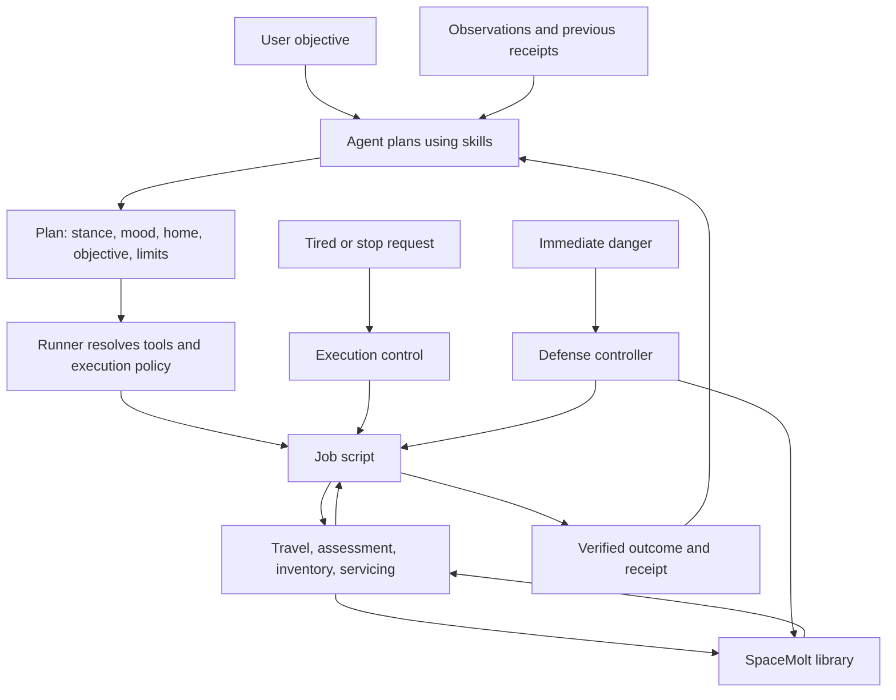

We’re done when an agent can take a broad objective, **choose its stance, mood, and home**, execute complete jobs through scripts, respond correctly to changing circumstances, and leave a verified outcome—without us supplying individual game commands.

Home should be an agent decision. We prompt it to consider where home should be, provide the relevant observations, and persist its choice. A temporary resupply stop should not automatically become home.

**The architecture we’re building**

The important separation is that **the agent makes plans, skills explain how to make them, and scripts carry out and enforce them**.

**1. Decisions we still need to settle**

| ID | Decision | Proposed starting point | Done when |
|---|---|---|---|
| D1 | Stance vocabulary | Combat, Hunt, Industry, Trade, Logistics, Explore, Salvage | Each has a distinct purpose and clear boundaries. |
| D2 | Mood vocabulary | Relaxed, Cautious, Focused, Opportunistic, Aggressive, Tired | Each resolves to explicit behavior rather than an adjective in a prompt. |
| D3 | Who changes stance/mood? | User instructions take precedence; agents may otherwise choose within their objective. Scripts may suspend unsafe work. | Transition authority and precedence are documented. |
| D4 | What determines home? | Agent chooses from observed locations based on access, services, storage, activity, and travel costs. | Home selection, reconsideration, and temporary fallback rules are defined. |
| D5 | What does a job promise? | A complete, bounded activity with verification and necessary cleanup. | Every job has explicit starting conditions and terminal outcomes. |
| D6 | How much discretion does a job have? | Scripts make mechanical decisions within a supplied plan; agents decide material changes of objective. | “Handle locally” versus “return to agent” is specified. |
| D7 | What does each mood change numerically? | Evidence requirements, reserve margins, pursuit limits, diversion rules, and stopping conditions. | We have an initial policy table with testable values. |
| D8 | What can agents initiate? | Explicit target/activity permissions, independent of mood. | Aggressive cannot silently broaden authorization. |
| D9 | How are interruptions handled? | Immediate control signals; no new jobs after Tired; active jobs exit through defined recovery paths. | Every job has interruption behavior. |
| D10 | What counts as success? | Objective-specific receipts: XP, delivered passengers/cargo, settled production, discoveries, or realized earnings. | Success never depends solely on model prose. |

**2. The execution context passed to scripts**

Stance and mood are part of a larger, explicit plan.

| Context value | Chosen or supplied by | Used for |
|---|---|---|
| `stance` | User or agent | Available jobs and tools |
| `mood` | User or agent | Default execution policy |
| `objective` | User, refined by agent | What the job is trying to accomplish |
| `home` | Agent | Normal return destination and operating base |
| `limits` | User constraints plus agent allocation | Spending, exposure, duration, cargo, ammunition |
| `permissions` | Authorized scope | Eligible activities and targets |
| `obligations` | Authoritative game state | Cargo contracts, passengers, pending production, deadlines |
| `intelligence` | Observations and reviewed evidence | Threat and opportunity assessment |
| `stop_condition` | Objective and policy | When to stop repeating productive work |
| `return_policy` | Agent plan and mood | Home, temporary service stop, or safe fallback |
| `job_id` / checkpoint | Runtime | Recovery and avoiding duplicate actions |
| `policy_version` | Implementation | Explaining and reproducing decisions |

The agent should not pass dozens of tuning parameters on every call. The runner resolves defaults; individual calls supply only meaningful overrides within their allowed bounds.

**3. Stance × tool × skill grid**

Four common game tools remain: **`observe`, `assess`, `prepare`, `travel`**.

| Stance | Additional tools | Skill teaches | Main job scripts |
|---|---|---|---|
| Combat | `guard`, conditionally `engage` | Defensive objectives, engagement selection, escort/patrol decisions | Guarding and combat engagement |
| Hunt | `track`, conditionally `hunt` | Quarry selection, training versus harvesting, intelligence gaps | Tracking and hunting |
| Industry | `gather`, `produce` | Mine versus buy, production chains, input allocation, settlement | Resource gathering and production |
| Trade | `trade` | Market depth, inventory exposure, opportunity cost | Purchase, transport where needed, sale |
| Logistics | `transport` | Freight and passenger suitability, capacity, deadlines, routes | Cargo and passenger transport |
| Explore | `survey` | Discovery objectives, coverage, useful intelligence | Exploration and surveys |
| Salvage | `salvage` | Wreck suitability, recovery capacity, contested locations | Wreck recovery and return |

**Tired replaces productive tools with `return_to_base`**, retaining observation and relevant skill access. Already-running scripts receive the override directly.

This is a small interface, not a requirement to rewrite every working implementation.

**4. Mood × mechanical behavior grid**

| Mood | Starting work | Assessment | During execution | Leaving or stopping |
|---|---|---|---|---|
| Relaxed | Low-pressure work; no initiating hostilities | Prefer simple, well-understood activity | Avoid pursuit and unnecessary escalation | Readily disengage; defend automatically if necessary |
| Cautious | Require stronger evidence and reserves | Larger uncertainty and escape margins | Reassess early when conditions worsen | Withdraw earlier |
| Focused | Start work that advances the assigned objective | Compare against that objective | Reject unrelated diversions; preserve continuity | Stop at the objective or an explicit blocker |
| Opportunistic | Consider worthwhile nearby alternatives | Include switching costs and existing obligations | Divert only at defined safe checkpoints | Switch when the measurable advantage justifies it |
| Aggressive | Actively pursue allowed opportunities | Accept tighter—but bounded—margins | Pursue longer or commit more resources where policy permits | Stop at enforced limits, not enthusiasm |
| Tired | Start no new productive work | Assess return routes and resupply needs | Resolve immediate danger and preserve existing obligations | Return, resupply, record unfinished work, stop |

“Mood” is therefore a convenient preset over several independent controls:

| Control | Examples |
|---|---|
| Initiative | Defend only / seek opportunities / initiate assessed encounters |
| Evidence requirement | Known capability / bounded uncertainty |
| Resource margins | Fuel, hull, ammunition, financial reserves |
| Pursuit | Duration, distance, retries |
| Attention | Stay on objective / consider diversions |
| Exit behavior | Finish current job / stop at next safe checkpoint / return now |

We should encode those controls once and have all scripts consume the same resolved policy.

**5. Skills to create**

We need **eight skills**, not a skill for every stance–mood combination.

| Skill | Required contents |
|---|---|
| Shared SpaceMolt operations | Tool meanings, authoritative state, choosing home, stance/mood transitions, obligations, interpreting receipts, Tired behavior |
| Combat | Guard versus engage, threat assessment, defensive planning |
| Hunt | Tracking, quarry selection, training objectives, escape outcomes |
| Industry | Gathering, production, input sourcing, settlement |
| Trade | Opportunity comparison, inventory risk, realized accounting |
| Logistics | Freight, passengers, admission checks, deadlines, delivery |
| Explore | Survey planning, coverage, discovery value |
| Salvage | Recovery assessment, cargo capacity, aftermath |

Every stance skill should have the same structure:

1. When to choose this stance.
2. What observations are needed.
3. How to choose and assess a job.
4. What each tool promises.
5. How moods affect the plan.
6. How to interpret success, blockers, and interruptions.
7. When to reconsider home, stance, or objective.

The shared and selected stance skills should load at session creation. Additional reference material can use native skill reading. Scripts must not depend on the model having remembered every instruction.

**6. Scripts and infrastructure to create or consolidate**

| ID | Work item | Existing foundation | Required result |
|---|---|---|---|
| S1 | Execution-context and policy resolver | Current mode-specific prompts and limits | One validated stance/mood policy consumed by all jobs |
| S2 | Toolset resolver and session handoff | Runner catalog filtering | Small toolsets with cache-safe transitions |
| S3 | Unified observation and assessment | Status, threat assessment, economic discovery, locations | Consistent inputs, evidence, explanations, and recommendations |
| S4 | Unified preparation and servicing | Combat fitting, mining readiness, raw services | Guaranteed readiness or a precise blocker |
| S5 | Shared travel executor | Existing routes and sortie travel | Verified movement, reserves, fallback destinations |
| S6 | Home decision and persistence | No complete workflow yet | Agent can choose, remember, explain, and reconsider home |
| S7 | Return-and-resupply executor | Return steps embedded in sorties | Stance-independent Tired behavior |
| S8 | Shared job lifecycle and checkpoints | Receipts and command boundary | Recoverable jobs with explicit terminal states |
| S9 | Reconnect and reconciliation | Safe stopping exists | Determine what happened before deciding what to resume |
| S10 | Universal defensive control | Hunting battle controller | Defense available during every stance |
| S11 | Combat and hunting jobs | Existing hunting scripts | Shared tactics, policy inputs, guarding and engagement contracts |
| S12 | Industry jobs | Mining and production workflows | Gathering and production under one stance; complete settlement |
| S13 | Trade job | Market tools and economic calculations | Complete bounded trading workflow |
| S14 | Logistics job | Proven freight primitives | Unified freight/passenger planning, execution, and verification |
| S15 | Exploration job | Location lookup and station surveys | General discovery objectives and coverage tracking |
| S16 | Salvage job | Hunting loot collection | Independent assessed wreck-recovery workflow |
| S17 | Repetition controller | Model-driven cycles | Repeat until objective, budget, Tired, or another stopping condition |
| S18 | Unified receipts | Existing gameplay and experiment logs | Comparable results across all stances |

**7. Cross-references we must enforce**

These are the relationships most likely to drift if they exist only in prose.

| Relationship | Required invariant |
|---|---|
| Skill ↔ tool catalog | Skills refer only to tools available in that session. |
| Tool ↔ script | Every exposed tool has a concrete executor and documented completion contract. |
| Mood ↔ script | Every relevant policy setting actually affects execution and has behavioral coverage. |
| Home ↔ travel | Home is persisted, reachable or explicitly substituted, and never confused with a temporary stop. |
| Job ↔ obligation | Returning or stopping does not silently discard passengers, cargo commitments, or queued work. |
| Defense ↔ stance | Defense works without an offensive tool being exposed to Hermes. |
| Checkpoint ↔ game state | Recovery reconciles authoritative state before replaying any uncertain action. |
| Receipt ↔ agent report | Claims about success, cost, and progression come from verified receipts. |
| Session ↔ policy change | Prompt/tool changes use handoff; urgent execution controls act immediately. |

**8. Acceptance grid: how we know we’re done**

| Test scenario | Required observable result |
|---|---|
| Broad objective, no supplied station IDs | Agent selects a sensible home and work location using observations. |
| Each of the seven stances | At least one complete representative job through the real Hermes path. |
| Industry | Both gathering and production complete, including servicing and settlement. |
| Logistics | Both freight and passenger jobs complete with verified delivery. |
| Relaxed combat | No first strike; defensive response still works. |
| Focused industry | Unrelated opportunities do not derail the job. |
| Aggressive hunt | Increased initiative follows explicit policy without bypassing assessment. |
| Tired while idle, traveling, working, or fighting | No new productive work; appropriate safe exit, return, resupply, and stop. |
| Home unavailable or unreachable | Explicit temporary fallback; no silent loss of the home choice. |
| Disconnect after an uncertain action | Reconciliation prevents duplicate purchases, jobs, attacks, or deliveries. |
| Model iteration budget expires | Active scripts still reach their defined safe terminal state. |
| Stance/mood changes | Correct policy takes effect without rebuilding historical prompt context. |
| Completion report | Costs, obligations, location, condition, and outcome are independently verifiable. |

We don’t need a live run of all **42 stance–mood combinations**. We need unit coverage of policy resolution, integration coverage of shared invariants, representative live jobs for every stance, and targeted interruption tests.

I’d implement this in three passes: **shared policy/home/job lifecycle first; complete Hunt, Industry, and Logistics next; then finish the remaining stances and run the acceptance grid.** That makes “done” a set of observable behaviors rather than a collection of new tool names.
